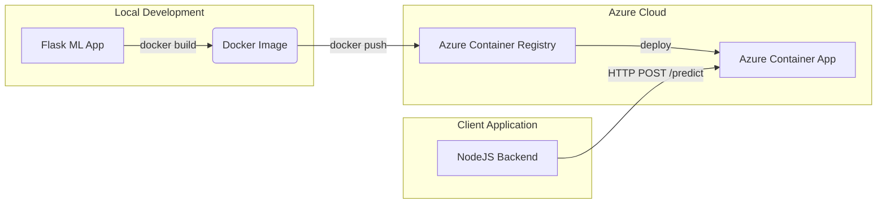

# Azure Deployment Guide: Hosting ML Model Container

This guide outlines the steps to host your ML model's Docker container in Azure using **Azure Container Registry (ACR)** and **Azure Container Apps (ACA)**, and then connect it to your backend.

---

## 🏗️ Architecture Overview



---

## 📋 Prerequisites

Before starting, ensure you have:
1. An active **Azure Subscription**.
2. **Azure CLI** installed ([Install Azure CLI](https://learn.microsoft.com/en-us/cli/azure/install-azure-cli)).
3. **Docker** running locally.

---

## 🚀 Step-by-Step Deployment

### Step 1: Login to Azure
Open your terminal (PowerShell, Command Prompt, or Bash) and run:
```bash
az login
```
*This will open a browser window for authentication.*

---

### Step 2: Create a Resource Group and Container Registry
Run the following commands to set up the resource group and Azure Container Registry:

```bash
# Define your variables (feel free to change names or regions)
RESOURCE_GROUP="deepfake-detector-rg"
LOCATION="eastus"
ACR_NAME="deepfakemlregistry"

# 1. Create a Resource Group
az group create --name $RESOURCE_GROUP --location $LOCATION

# 2. Create the Container Registry
az acr create --resource-group $RESOURCE_GROUP --name $ACR_NAME --sku Basic --admin-enabled true
```
> [!NOTE]
> Azure Container Registry name must be globally unique and contain only alphanumeric characters.

---

### Step 3: Tag and Push the Local Image to ACR
To push your local Docker image to ACR, you must tag it with your registry's login server address.

```bash
# 1. Log in to your ACR instance
az acr login --name $ACR_NAME

# 2. Tag your local image
# (Replace 'deepfakemlregistry.azurecr.io' with your registry's login server)
docker tag deepfake-ml-model:latest $ACR_NAME.azurecr.io/deepfake-ml-model:v1

# 3. Push the image to Azure
docker push $ACR_NAME.azurecr.io/deepfake-ml-model:v1
```

---

### Step 4: Deploy to Azure Container Apps (ACA)
Azure Container Apps is a fully managed serverless container service. It is highly recommended because it can **scale down to zero** when idle to save costs.

```bash
# 1. Register the Container Apps extension in CLI (if not already installed)
az extension add --name containerapp --upgrade

# 2. Register required providers
az provider register --namespace Microsoft.App

# 3. Deploy the container app
az containerapp up \
  --name deepfake-ml-api \
  --resource-group $RESOURCE_GROUP \
  --location $LOCATION \
  --ingress external \
  --target-port 5000 \
  --image $ACR_NAME.azurecr.io/deepfake-ml-model:v1 \
  --registry-server $ACR_NAME.azurecr.io
```

During deployment, you will be prompted to create an environment. It will set up ingress, scale settings, and output a **FQDN (Fully Qualified Domain Name)** (e.g., `https://deepfake-ml-api.eastus.azurecontainerapps.io`).

---

### Step 5: Configure Scaling to Zero (Optional & Recommended)
By default, Azure Container Apps keeps 1 replica running. To scale to 0 when not receiving traffic:

1. Open the [Azure Portal](https://portal.azure.com).
2. Go to your **Azure Container App** (`deepfake-ml-api`).
3. Click on **Scale** under Settings.
4. Set **Min replicas** to `0` and **Max replicas** to `1` (or more).
5. Save changes.

---

## 🔗 Connect Your Backend

Once your container is running in Azure:
1. Copy the public URL of your Container App (e.g. `https://deepfake-ml-api.eastus.azurecontainerapps.io`).
2. Open your backend environment file [backend/.env](file:///d:/FYP/Deep-Fake-Video-Detector/backend/.env).
3. Update `ML_SERVICE_URL` to point to your new Azure URL + `/predict`:
   ```env
   ML_SERVICE_URL=https://deepfake-ml-api.eastus.azurecontainerapps.io/predict
   ```
4. Restart your NodeJS backend server.

---

## 🧪 Verification

To test that your Azure-hosted container is active, run:
```bash
curl https://deepfake-ml-api.eastus.azurecontainerapps.io/health
```
It should return:
```json
{
  "status": "ok",
  "service": "spatial-deepfake-detector"
}
```
